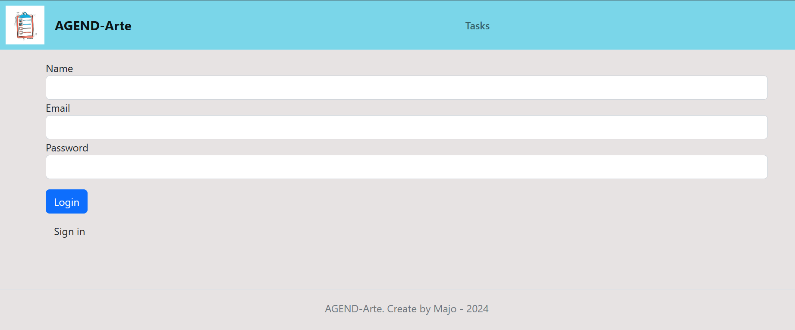
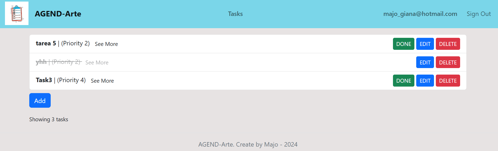

📝 To-Do List App with User Login (PHP + MySQL)  
  
This is a simple To-Do List application built with **PHP** and **MySQL**, allowing users to register, log in, and manage their personal task list. Each user's tasks are private and securely stored in a relational database.  
  
---  
  
## 🚀 Features  
  
- ✅ User registration and login  
- 🔐 Session-based authentication  
- 📋 Create, read, update, delete (CRUD) tasks  
- 🧑 Each user sees only their own tasks  
- 📌 Task priority system (1 to 5)  
- ✔️ Mark tasks as completed  
- 🧼 Clean and minimal Bootstrap-based UI  
- 🛠️ MVC model  
  
---  
  
## 🛠️ Technologies  
  
- PHP  
- MySQL / MariaDB  
- HTML / Bootstrap  
- PDO (for secure DB access)  
  
---  
  
##   Import the Database:
  
You can find the SQL schema inside the db/ folder.  
Import the db_tareas.sql file into your MySQL database using phpMyAdmin or command line:  
CREATE DATABASE db_tareas;  
USE db_tareas;  
-- Import db_tareas.sql here  
  
##  Configure the Database Connection:
  
Edit your database connection parameters to match your environment (usually in the model or DB class file).  
  
Example:  
$this->db = new PDO('mysql:host=localhost;dbname=db_tareas;charset=utf8', 'root', '');  
  
## 🚀 Run locally:  
  
If you're using XAMPP/MAMP, place the project in the htdocs folder.
Open the app in your browser: http://localhost:8000  
  
## 🔐 Authentication Logic  
  
- User credentials are stored securely with password_hash.  
- Sessions are started on login using session_start().  
- Routes that require authentication are protected by middleware.  
- Each task belongs to a user (id_usuario), and only that user can view, edit, or delete their tasks.  

  
  
  
   
